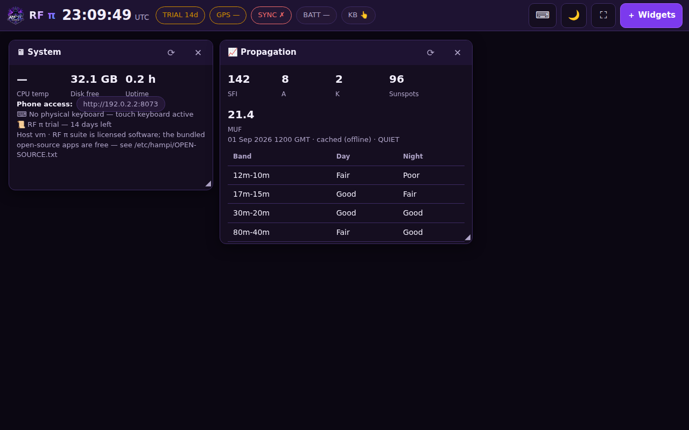
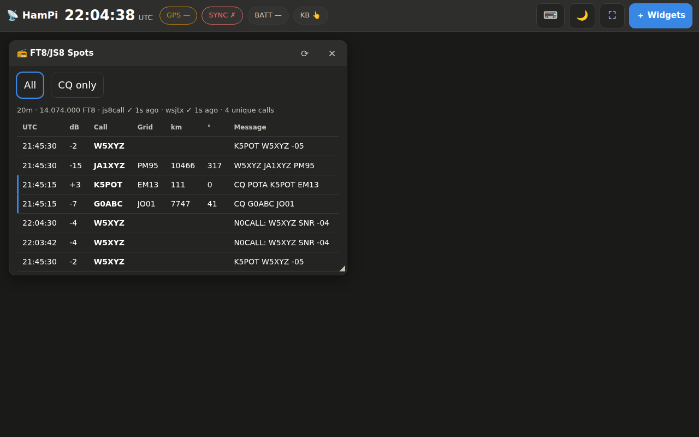
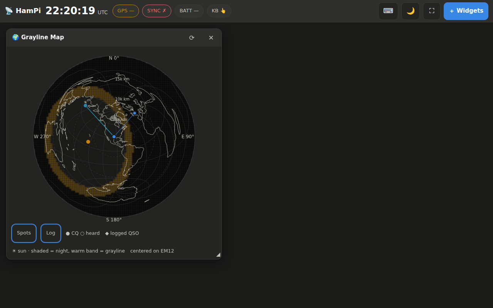

# RF π (RF Pi) — K4DIA Amateur Radio Software Suite


**Tony (PapaDark) · K4DIA** — a reproducible, flashable Raspberry Pi OS
(Bookworm, 64-bit, desktop) image purpose-built for portable/field amateur
radio operation, plus an installer you can run on any existing Raspberry Pi
OS system. Linux all the way down — nothing here is locked to Pi-only
software, but it is tuned to run outstanding on a Raspberry Pi 4 (including
one mounted in a **RasPad 3** tablet) and Pi 5. The UI carries the RF Pi
look: electric purple and neon blue on near-black, chrome text.

Command names: the tools install under their original `hampi-*` names and
paths (config lives in `/etc/hampi/`), and every tool also answers to an
`rfpi-*` alias — plain `rfpi` opens the field menu.

**Licensing:** the RF π *suite* (dashboard, field tools, logbook, artwork) is
proprietary software © 2026 K4DIA. The image also bundles free open-source
apps (WSJT-X, fldigi, Direwolf, CHIRP, …) under their own licenses — those are
**never** locked and are not what a purchase covers. Unlicensed installs run a
full-featured trial (default 14 days), then the suite locks until a callsign-
bound license key is entered; the open-source apps and your own logbook export
keep working regardless. Enforcement only activates in images built with a
vendor key, so this open build stays free for development and personal use.
Vendors: see [`LICENSING.md`](LICENSING.md); buyers: `/etc/hampi/LICENSE-RFPI.txt`
and `/etc/hampi/OPEN-SOURCE.txt`.

## What's on the image

| Need | Software |
|---|---|
| Digital modes | WSJT-X (FT8/FT4/WSPR), JS8Call, fldigi + flmsg/flamp (NBEMS EmComm), QSSTV, multimon-ng |
| CAT control | Hamlib (`rigctl`/`rigctld` network CAT server), flrig, grig |
| Radio programming | CHIRP-next (Baofeng/Yaesu/Icom/Kenwood memory programming) |
| Packet / APRS / Winlink | Direwolf software TNC, Xastir, Pat (Winlink email) |
| Propagation | HamClock, VOACAP (`voacapl`), `hampi-prop` (live N0NBH solar indices + band conditions + advice, offline cache) |
| Antennas | `hampi-antenna` field cutting charts (dipole, inverted-V, EFHW, vertical+radials, NVIS, J-pole, random wire, choke) and great-circle **beam headings** from grid squares; xnec2c/nec2c modelling |
| Power / battery | `hampi-power`: INA219/INA260 I2C battery monitor — volts, amps, watts, state-of-charge for LiFePO4 & lead-acid, CSV logging, low-voltage alerts, Pi under-voltage flags |
| Weather | `hampi-wx` (GPS-located forecast with wind/antenna warnings, offline cache, METAR), `metar` |
| Off-grid time | gpsd + chrony pre-wired: plug in any USB GPS and the clock stays FT8-accurate with **no internet** |
| Satellites | Gpredict (pass prediction, doppler, rotator control) |
| SDR waterfall | Gqrx + CubicSDR (SDR++ too when upstream ships an arm64 build), `hampi-waterfall` launcher with headless `rtl_power` band scans, SoapySDR + Airspy/HackRF support, RTL-SDR DVB-T driver pre-blacklisted |
| Logging | KLog, TrustedQSL (LoTW) |
| Touch dashboard | `hampi-dash` — tablet-first widget UI (see below) + `hampi-menu` terminal menu |

Everything is listed on the Pi itself in `/etc/hampi/APPS.txt` (also via the
menu's "apps" entry).

## Getting the image

### Option A — GitHub Actions (no build machine needed)
Run the **Build RF Pi image** workflow from the repo's Actions tab. It builds
the full image with pi-gen and uploads `*.img.xz` as an artifact
(~2 h runtime). Set a repo secret `HAMPI_PASSWORD` to bake in your own
password; otherwise the default is `hampi-field`.

### Option B — build locally with Docker
On any Linux box with Docker and ~30 GB free:

```bash
cd ham-radio-pi
FIRST_USER_PASS='YourPassword' ./build.sh
# output: ham-radio-pi/pi-gen/deploy/<date>-RFPi-hampi.img.xz
```

### Option C — install onto an existing Raspberry Pi OS
Already running Raspberry Pi OS Bookworm (64-bit recommended)? Skip the image:

```bash
git clone https://github.com/ALIGN-Tony/PapaDark-Music
cd PapaDark-Music/ham-radio-pi
sudo ./setup.sh            # add --raspad on a RasPad 3
sudo reboot
```

The installer is idempotent and best-effort: if a download host is down, that
one component is reported at the end and you just re-run `setup.sh` later.

## Flash & first boot

1. Flash with Raspberry Pi Imager (or `xzcat img.xz | sudo dd of=/dev/sdX bs=4M`).
2. Boot. Login: **hamop / hampi-field** (change it: `passwd`). Hostname `rfpi`, SSH enabled.
3. Set your station identity:
   ```bash
   sudo nano /etc/hampi/station.conf     # CALLSIGN, GRID, LAT/LON
   ```
4. Run `hampi-menu` (or the "RF Pi Field Menu" desktop icon).

## The touch dashboard



`hampi-dash` (systemd service, port 8073) serves a **tablet-first widget
dashboard** — the RasPad's home screen. Launch it on the touchscreen with the
"RF Pi Dashboard" desktop icon or `hampi-kiosk` (it also autostarts with the
desktop; delete `/etc/xdg/autostart/hampi-dashboard.desktop` to opt out).

- **Widgets, all live at once**: propagation, power/battery with voltage
  graph, rig CAT control, logbook, weather, GPS/time, antenna calculator,
  beam headings, spectrum scan, system status. Open as many as you want from
  **＋ Widgets**; drag by the title bar, resize by the ◢ corner, tap to bring
  to front. Layouts persist per device.
- **Keyboard behavior**: an on-screen keyboard pops up for text fields on
  touch. The moment a **USB or Bluetooth keyboard** is attached (or a real
  key is pressed), the physical keyboard becomes the default and the
  on-screen keys stay out of the way; unplug it and touch input returns. The
  ⌨ button forces the OSK always-on or always-off. The image also carries
  squeekboard/matchbox-keyboard for non-dashboard desktop apps.
- **Logbook**: quick QSO entry (callsign, freq auto-filled from the rig,
  mode, RSTs), search, and one-tap **ADIF export** for LoTW/your main logger.
- **Rig widget**: reads and tunes via `rigctld`. There is deliberately no TX
  button — keying the transmitter stays a physical act.
- **Live FT8/JS8 spots**: the Spots widget listens to WSJT-X's UDP broadcast
  (Settings → Reporting → UDP Server `127.0.0.1:2237`, the default) and
  JS8Call's UDP API (port 2242, enable it in Settings → Reporting). Every
  decode appears live with SNR, extracted callsign/grid, **distance and beam
  heading from your station**, with a CQ-only filter and CQ rows highlighted.
  Tap a spot to pre-fill the Logbook form. A QSO you log in WSJT-X is
  **auto-inserted into the RF Pi logbook** too. `?open=spots&solo=1` on the
  URL makes a dedicated spots kiosk display.

  

- **Grayline / azimuthal map**: a great-circle map centered on *your*
  station (GPS fix, or your grid square). Because it's an azimuthal
  equidistant projection, every straight line from the center is the true
  great-circle path — the screen angle **is** the beam heading and the
  radius is the distance. Live day/night shading with the **grayline band**
  and sun position (recomputed every minute, fully offline — coastlines are
  built in from Natural Earth data), distance rings at 5/10/15 thousand km,
  and your **actual RF contacts plotted live**: FT8/JS8 spots stream in from
  the Spots feed (CQs filled, heard stations hollow, fading with age) and
  logged QSOs — digital or voice, anything you enter in the logbook with a
  grid — appear as diamonds. Tap any marker for call, grid, distance,
  bearing, and age. Work the grayline by literally watching your contacts
  land on it.

  

- **Night mode** (🌙): red-on-black palette to preserve night vision.
- **From your phone**: `hampi-hotspot up` (or the menu's hotspot entry)
  starts a Wi-Fi access point; join **RFPi** and open
  `http://10.42.0.1:8073` — same widgets in a stacked phone layout. On a
  normal network, use any address shown in the System widget. No internet
  required for any of it.
- **Hotspot auto-start**: at boot, if no known Wi-Fi or ethernet comes up
  within ~45 s (and no saved network is even in range), the Pi starts the
  hotspot by itself — so in the field it's phone-ready with zero screen
  interaction. At home it stays on your normal Wi-Fi. Opt out with
  `sudo touch /etc/hampi/hotspot-auto.disabled`; return to normal Wi-Fi any
  time with `hampi-hotspot down`.

The dashboard has no login — it trusts whoever is on your hotspot/LAN
(set your own hotspot password). Don't expose port 8073 to the internet.

## Wiring up the shack

**CAT control** — plug the radio's USB/CAT cable in, then serve CAT to every
app at once:

```bash
rigctl -l | grep -i <your radio>          # find the model number
rigctld -m 3087 -r /dev/ttyUSB0 &         # example: IC-7300
```

Point WSJT-X/JS8Call/fldigi at *Hamlib NET rigctl*, `localhost:4532`. One
radio, every program shares it. The menu's "rig" entry walks through a test.

**Sound** — DigiRig/Signalink/radio-USB soundcards appear via `arecord -l`;
select them inside WSJT-X/fldigi/Direwolf (`ADEVICE plughw:1,0`).

**GPS time (critical for FT8 off-grid)** — plug in any USB GPS puck. gpsd
auto-detects it and chrony (see `/etc/chrony/conf.d/hampi-gps.conf`) steers
the clock to well under a second. For microsecond time, wire the GPS PPS pin
to GPIO18 and uncomment the `pps-gpio` overlay in `config.txt` plus the PPS
refclock line.

**Battery monitor** — wire an INA219 (or INA260) module: `VIN+/VIN-` in the
battery positive lead, module GND to battery negative and Pi GND, `SDA`→pin 3,
`SCL`→pin 5, `VCC`→3V3 (pin 1). Then:

```bash
i2cdetect -y 1                       # sensor shows at 0x40
sudo nano /etc/hampi/power.conf      # chemistry: lifepo4 or leadacid
hampi-power                          # one-shot status
sudo touch /etc/hampi/power.enabled  # start background logging + alerts
sudo systemctl start hampi-power
```

You get live volts/amps/watts, a state-of-charge estimate, CSV history in
`/var/log/hampi/power.csv`, and `wall`/syslog alerts before the battery gets
damaged or the finals brown out mid-QSO.

**APRS/packet** — `cp /etc/hampi/direwolf.conf ~/`, set `MYCALL`, run
`direwolf`. Xastir and Pat talk to its KISS port (8001).

**Winlink** — `pat configure`, then `pat connect telnet` (internet) or via
Direwolf/ARDOP RF gateways for true off-grid email.

**SDR waterfall** — plug in an RTL-SDR (or Airspy/HackRF) and run
`hampi-waterfall` (or the "SDR Waterfall" desktop icon): it verifies the
dongle and launches the best installed app (SDR++ → Gqrx → CubicSDR). The
kernel's DVB-T driver is already blacklisted, so dongles work on first plug.
Over SSH with no desktop, survey a band instead:

```bash
hampi-waterfall --check              # is the dongle seen?
hampi-waterfall --scan 144M:148M 15  # 15 s sweep, prints strongest signals
```

Handy in the field for spotting repeater activity, checking your own
transmitted signal, or finding a quiet frequency before you call CQ.

## Field workflow examples

```bash
hampi-prop                      # is 20m open? what should I run right now?
hampi-antenna 40m               # cutting chart: dipole/inverted-V/EFHW/NVIS...
hampi-antenna 7.1 --type nvis   # regional EmComm coverage antenna
hampi-antenna --heading JO01    # beam heading + distance from your grid
hampi-prop --voacap JO01        # full VOACAP circuit prediction
hampi-wx --metar KDFW           # forecast + gust warnings for your masts
hampi-power                     # how much battery is left?
```

`hampi-prop` and `hampi-wx` cache their last good reports, so you can review
conditions after you've lost internet in the field.

## RasPad 3 notes

The RasPad 3 is a Pi 4 carrier, so the stock image boots it as-is. The image
build already includes the SunFounder `raspad-launcher` (screen rotation,
touch-friendly launcher, onboard-battery indicator); on an existing system run
`sudo ./setup.sh --raspad`. HamClock at 800×480 fits the 1280×800 touchscreen
nicely windowed; the terminal tools are all touch-keyboard friendly via the
launcher. The RasPad's internal battery is separate from the *station* battery
monitor — `hampi-power` watches your 12 V radio supply.

## Layout

```
ham-radio-pi/
├── build.sh            # local pi-gen (Docker) image build
├── pi-gen.config       # image settings (hostname, user, stages)
├── prepare-stage.sh    # copies installer+payload into the pi-gen stage
├── stage-ham/          # custom pi-gen stage (runs setup.sh in the chroot)
├── setup.sh            # the installer (image build AND standalone use)
└── payload/
    ├── tools/          # hampi-menu, hampi-prop, hampi-antenna, hampi-power, hampi-wx
    ├── configs/        # /etc/hampi templates (station, power, direwolf, APPS)
    ├── systemd/        # hampi-power.service
    └── desktop/        # menu + HamClock launchers
```

## License / data sources

Solar data: N0NBH (hamqsl.com). Weather: Open-Meteo & aviationweather.gov.
VOACAP: jawatson/voacapl. HamClock: Clear Sky Institute (WB0OEW). Map
coastlines: Natural Earth (public domain; regenerate with
`scripts/make-world-json.py`). All installed applications retain their own
licenses.
